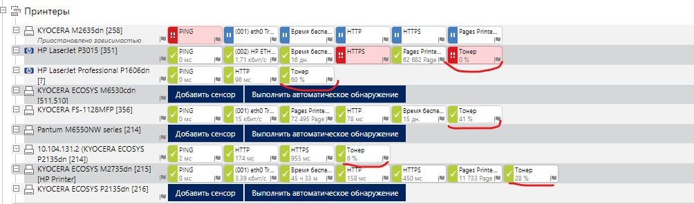

# PRTG

Данный раздел содержит вспомогательные скрипты, позволяющие автоматизировать работу с
системой мониторинга сетевых устройств PRTG и расширить ее функционал. Стоит отметить, что данная программа ориентирована на 
мониторинг устройств по snmp-протоколу, потому работу по другим протоколам необходимо реализовывать самостоятельно в виде кастомных 
сенсоров. 

[printer_toner_level.py](https://github.com/devFF/FindJob/blob/main/Projects/PRTG_Custom_Sensor/printer_toner_level.py) - 
реализация кастомного сенсора для PRTG, который позволяет вытащить уровень тонера с его web-страницы. 
Для реализации были использованы библиотеки re, sys, json и requests, а также утилита webinspector, встроенная в гугл хром. 
Была поставлена задача - написать универсальный скрипт, который позволяет парсить любые принтеры, имеющиеся в сети, а также, 
чтобы добавление нового типа принтера в скрипт не было проблематичным. Требований к производительности не было установлено, 
хотя здесь конечно стоило реализовать многопточность для запросов по различным паттернам.
Как работает программа? Система мониторинга с некоторой периодичностью запускает скрипт, передавая на вход программе json-структуру, содержащую ip устройства. 
По известным шаблонам скрипт обращается к web-интерфейсу устройства и парсит его по имеющимся паттернам. На выход программа передает json-структуру, с которой 
умеет работать PRTG. 
Добавление нового типа принтера реализовано достаточно просто. Для начала необходимо открыть web-страницу принтера с включенным веб инспектором и 
среди ресурсов найти страничку, содержащую в себе информацию об уровне тонера. Затем пишется регулярка, которая позволяет вытщить значение уровня 
тонера из этой страницы. Отдельным скриптом тестируем работу регулярки и в случае успешного прохождения теста добавляем получившийся паттерн в словарь. 

 
 

