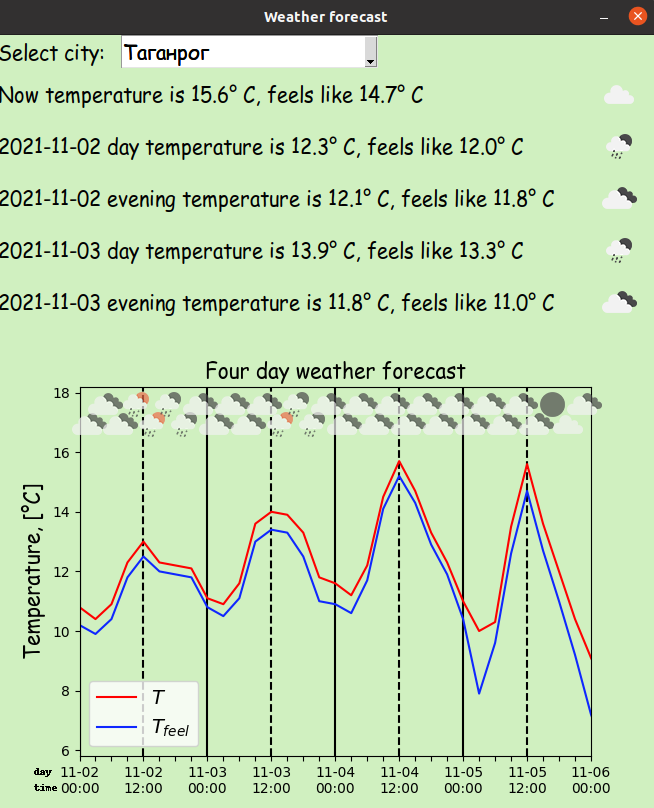

# Description:
The program for determining the weather forecast in Russian cities.


# Working with source code:
1) Sign up and generate API key: https://home.openweathermap.org/api_keys
2) Create API.txt in the directory of the py file and insert the API key into it
3) For the correct work of the source, execute: 
* ```pip3 install lxml```
* ```sudo apt install font-manager```
* ```sudo apt-get install msttcorefonts -qq```
* ``` rm -r ~/.cache/matplotlib```

# Bug fixes at building source code:

1) To fix requests error *"Could not find a suitable TLS CA certificate bundle"*:

Create a **hook-requests.py** file in (venv) PyInstaller\hooks\ for the requests lib containing

```Python
from PyInstaller.utils.hooks import collect_data_files
# Get the cacert.pem
datas = collect_data_files('requests')
```

And add this in the begining of main py-file:

```Python
if getattr(sys, 'frozen', None):  # keyword 'frozen' is for setting basedir while in onefile mode in pyinstaller
    basedir = sys._MEIPASS
else:
    basedir = os.path.dirname(__file__)
    basedir = os.path.normpath(basedir)

# Locate the SSL certificate for requests
os.environ['REQUESTS_CA_BUNDLE'] = os.path.join(basedir, 'requests', 'cacert.pem')
```

Then build:

```
pyinstaller --onefile Weather_v6.py
```

2) To fix error *"bs4.FeatureNotFound: Couldn't find a tree builder"*:

Install the current development version of pyinstaller: 

```
pip install https://github.com/pyinstaller/pyinstaller/archive/develop.tar.gz
```

3) To fix error *"ModuleNotFoundError: No module named 'PIL._tkinter_finder'"*:

Edit a **hook-PIL.Image.py** file in (venv) PyInstaller\hooks\:

Instead:

```Python
hiddenimports = collect_submodules('PIL', lambda name: 'ImagePlugin' in name)
```

Paste:

```Python
hiddenimports = collect_submodules('PIL', lambda name: 'ImagePlugin' in name or 'tkinter' in name)
```

And build: 

```
pyinstaller --onefile Weather_v6.py
```


